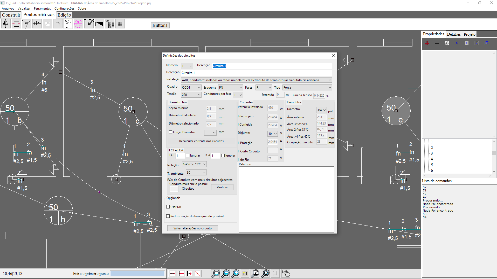

# FS_Cad
Cad para projetos elétricos com importação DXF e saida em DXF e PDF, cálculos conforme NBR-5410

Desenvolvido em Lazarus (Free Pascal)

Para rodar rápido:
Baixe todos os arquivos, extrai e coloque em uma pasta.
Instale o Lazarus. 
Abra o arquivo FS_Cad.lpi
e execute a aplicação, no botão play...

Por menores:

-Nativo Lazarus, não usa bibliotecas de terceiros, somente a fspreadsheet que pode ser instalada a partir do próprio ambiente (pertence ao Lazarus).

-Imporatação de DXF (parcial limitado a entidades simples);

-Exportação em DXF, o que você vê é o resultado final.

-Gerar PDF do desenho em formato grande.

-Atende a NBR-5410 (parcialmente).

-Determinação automática dos caminhos...

-Falta muita coisa a ser feita, toda ajuda é bem vinda.

-Arquivo de ajuda, por enquanto nada, precisa.

